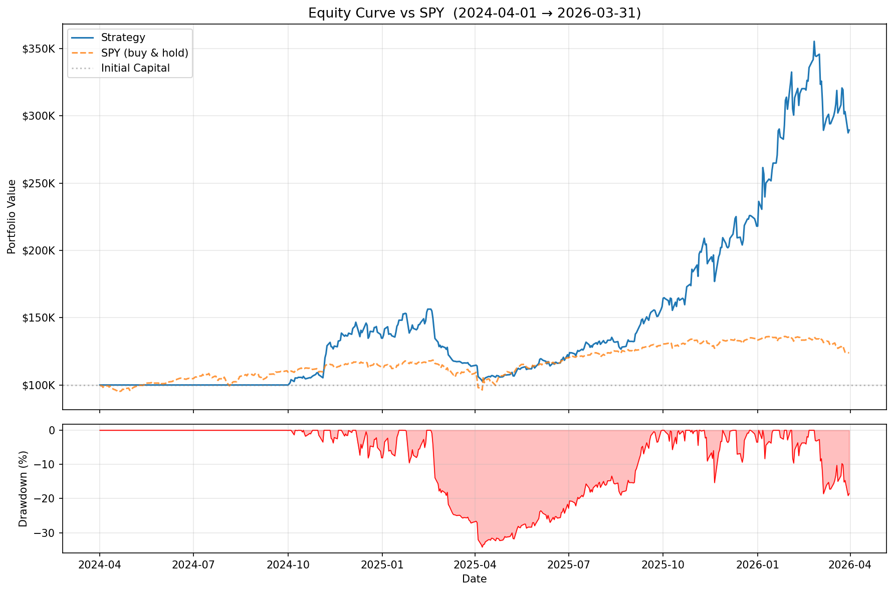
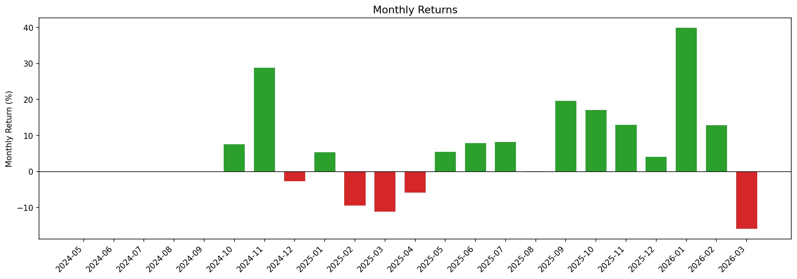

<div align="center">

# 📈 Quant-Trade

**RPS-based quantitative trading system for US stocks**

[](https://www.python.org)
[](LICENSE)

[Features](#features) · [Backtest Results](#backtest-results) · [Quick Start](#quick-start) · [Configuration](#configuration) · [Architecture](#architecture)

</div>

---

## Why

Most retail quant systems are either too simple (buy the dip) or too complex (black-box ML). This one is transparent: it ranks stocks by Relative Price Strength across 20/60/120-day windows, filters by volume and optionally fundamentals, and exits using a layered stop system. Every decision is logged and reproducible.

Tested with **$100K simulated capital over 2 years (2024–2026)**.

---

## Backtest Results

| Metric | Strategy | SPY (Benchmark) |
|--------|----------|-----------------|
| Period | 2024-04-01 → 2026-03-31 | same |
| Initial Capital | $100,000 | $100,000 |
| Final Capital | **$289,469** | ~$124,000 |
| Total Return | **189.47%** | ~24% |
| CAGR | **67.05%** | ~11% |
| Sharpe Ratio | **1.64** | ~0.9 |
| Max Drawdown | -34.23% | ~-19% |
| Win Rate | 52.48% | — |
| Avg Win | +13.11% | — |
| Avg Loss | -7.19% | — |

> **Disclaimer**: Past performance does not guarantee future results. This is not financial advice. Always paper trade before going live.

### Equity Curve



### Monthly Returns



---

## Features

- **RPS Screening** — ranks stocks by 20/60/120-day relative price strength; filters universe to top N% performers
- **Multi-factor Scoring** — combines RPS rank, volume, and optional fundamental filters (P/E, market cap)
- **Layered Exit System** — stop loss, trailing stop, MACD death cross, take profit, and time stop
- **Position Management** — equal-weight sizing with daily buy cap (`max_buy`) and total position limit (`max_own`)
- **Backtesting Engine** — full historical simulation; outputs equity curve, drawdown chart, and trade log
- **Live Trading** — Interactive Brokers API integration via `ib_insync`; supports paper and live accounts
- **Data Management** — SQLite-backed local store with yfinance for full history and daily incremental updates
- **Daily Automation** — cron-ready `run.py --step all` runs the full pipeline after market close

---

## Quick Start

### Prerequisites

- Python 3.10+
- Interactive Brokers TWS or IB Gateway (for live/paper trading only)

### 1. Install

```bash
git clone https://github.com/Donvink/quant-trade.git
cd quant-trade

conda create -n quant-trade python=3.10 -y
conda activate quant-trade

pip install -r requirements.txt
```

### 2. Configure

```bash
cp config.example.yaml config.yaml
```

Edit `config.yaml` — key parameters:

```yaml
screener:
  rps_threshold: 85       # only stocks in top 15% by RPS
  max_buy: 3              # max new positions per day
  max_own: 5              # max total open positions

risk:
  stop_loss_pct: -10
  take_profit_pct: 30
  trailing_stop_pct: 10
  max_hold_days: 25
```

### 3. Download Data

```bash
python run.py --step update
```

### 4. Run Backtest

```bash
python run.py --step backtest
```

### 5. Paper Trading

Start IBKR TWS or IB Gateway and log into your paper account, then:

```bash
# Dry run — logs orders without submitting
python run.py --step trade --dry-run

# Live paper trading
python run.py --step trade
```

---

## Command Reference

| Command | Description |
|---------|-------------|
| `python run.py --step all` | Full pipeline: update → screen → monitor → trade → backtest |
| `python run.py --step update` | Download / update market data |
| `python run.py --step screen` | Run RPS screener, write candidates to cache |
| `python run.py --step trade` | Execute trades based on cached candidates |
| `python run.py --step monitor` | Run stop-loss checks |
| `python run.py --step backtest` | Run full historical backtest |
| `--dry-run` | Simulate orders without submitting |
| `--force-refresh` | Force re-download of data and stock pool |

---

## Configuration

All parameters live in `config.yaml` (gitignored — copy from `config.example.yaml`).

```yaml
risk:
  stop_loss_pct: -10          # hard stop
  take_profit_pct: 30         # profit target
  trailing_stop_pct: 10       # trailing stop from peak
  max_hold_days: 25           # time stop
  min_hold_days: 3            # min hold before any exit
  use_macd_sell: false        # exit on MACD death cross

screener:
  rps_threshold: 85           # percentile cutoff (85 = top 15%)
  rps_periods: [20, 60, 120]  # lookback windows
  max_buy: 3                  # new buys per day
  max_own: 5                  # max open positions
  use_fundamentals: false     # add P/E and market cap filters
  order_by: "total_score"     # rank by: total_score | turnover | turnover_avg

ibkr:
  host: "127.0.0.1"           # WSL2: use Windows host IP
  port: 7497                  # 7497 = paper, 7496 = live
  client_id: 1

data_source: "yfinance"       # yfinance | polygon
commission: 0.001             # 0.1% per trade
```

---

## Architecture

```
quant-trade/
├── quant_trade/
│   ├── core/
│   │   ├── config.py          # all parameters, loaded from config.yaml
│   │   ├── data_manager.py    # SQLite store, yfinance download, daily update
│   │   ├── rps_calculator.py  # RPS ranking across N-day windows
│   │   ├── factors.py         # volume, fundamental scoring
│   │   ├── stock_pool.py      # S&P 500 and large-cap universe
│   │   └── ticker_fetcher.py  # full US market ticker list
│   ├── analysis/
│   │   ├── screener.py        # RPS screener, writes candidates to cache
│   │   ├── backtest.py        # historical simulation engine
│   │   ├── generate_report.py # equity curve, monthly returns chart
│   │   └── optimize.py        # parameter grid search
│   ├── trading/
│   │   ├── ibkr_client.py     # IBKR order execution via ib_insync
│   │   ├── risk_checker.py    # pre-trade risk validation
│   │   └── stop_loss_monitor.py
│   └── utils/
│       └── update_fundamentals.py
├── scripts/
│   └── daily_run.sh           # cron wrapper
├── tests/
├── config.example.yaml
├── run.py                     # entry point
└── requirements.txt
```

### Position Sizing

- Each stock targets `net_asset_value / max_own` in market value
- Daily buys capped at `max_buy` new positions
- Cash shortfall distributes proportionally across candidates

### Exit Logic (priority order)

1. Hard stop loss (`stop_loss_pct`)
2. Trailing stop from peak (`trailing_stop_pct`)
3. Take profit (`take_profit_pct`)
4. MACD death cross (optional, `use_macd_sell: true`)
5. Time stop (`max_hold_days`)

---

## Daily Automation

```bash
crontab -e
# Run after US market close (04:30 UTC Mon-Fri)
30 4 * * 1-5 /path/to/conda/envs/quant-trade/bin/python /path/to/quant-trade/run.py --step all >> /path/to/quant-trade/data/logs/daily.log 2>&1
```

> `conda activate` does not work in cron — use the full Python path. Find it with: `conda activate quant-trade && which python`

---

## Dependencies

- `pandas`, `numpy` — data processing
- `yfinance` — market data
- `ib_insync` — Interactive Brokers API
- `pandas_ta` — technical indicators (MACD etc.)
- `matplotlib` — backtest charts
- `tqdm` — progress bars
- `pyyaml` — config parsing

---

## Important Notes

1. **Paper trade first** — validate with a paper account before using real capital
2. **Data quality** — yfinance is free but may have gaps; for production consider Polygon.io (`polygon_api_key` in config)
3. **Backtest limitations** — results use adjusted close prices; slippage and partial fills are not modeled
4. **IBKR requirement** — live/paper trading requires an Interactive Brokers account with TWS/IB Gateway running locally

---

## Roadmap

- [ ] Web dashboard for real-time portfolio monitoring
- [ ] Polygon.io as primary data source option
- [ ] A-share / Hong Kong stock support
- [ ] ML-based factor weighting

---

## Contributing

Issues and pull requests welcome.

---

## License

MIT License © [Leo Zhong](https://github.com/Donvink)
